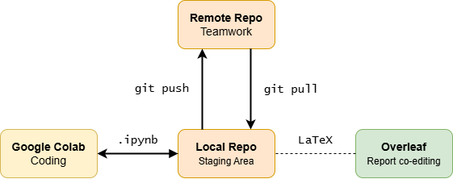
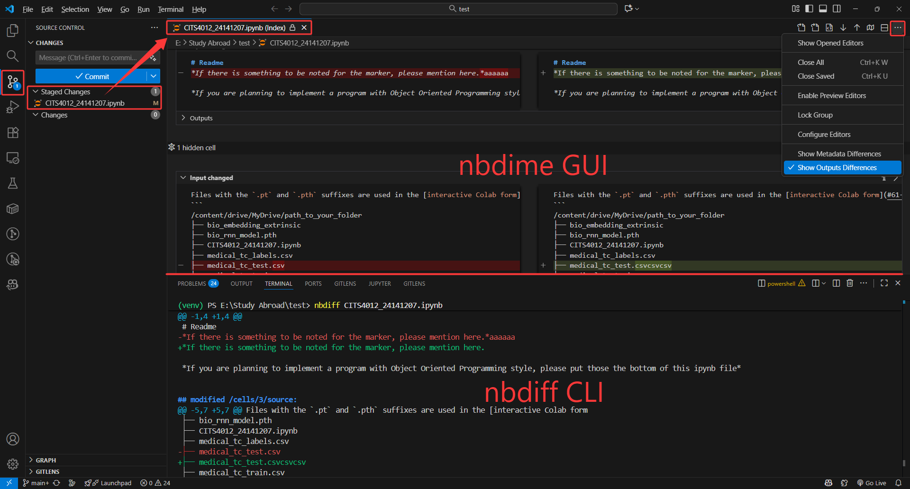

# CITS4012-NLP

## 🤝Collaborators

| Uni ID   | Student Name  | GitHub Username                                   |
| -------- | ------------- | ------------------------------------------------- |
| 24141207 | Kaichao Zheng | [Kaichao-Zheng](https://github.com/Kaichao-Zheng) |
| 24645175 | Ziqi Meng     | [jiongge39](https://github.com/jiongge39)         |
| 23998001 | Yanglei Yuan  | [LeoYuan0225](https://github.com/LeoYuan0225)     |

## 🚀How We Collaborate

[](#work-on-jupyter-notebook) [](#work-on-latex-report)




## 💻Work on Jupyter Notebook

### Installation

```bash
git clone https://github.com/Kaichao-Zheng/CITS4012-NLP.git
```

### Enable `.ipynb` version control using `nbstripout`

* `nbstripout` automatically remove the output cells from `.ipynb` files during commits, preventing unnecessary clutter in the remote repository.

```bash
pip install nbstripout
nbstripout --install
```

### Enable `.ipynb` difference using `nbdime`

* By default, `git diff` displays `.ipynb` files in JSON format, which is not very readable.

```bash
pip install nbdime
nbdime config-git --enable
```

### Check `.ipynb` Difference

#### Option 1: Default Git Diff

```bash
git diff CITS4012_Group9.ipynb
```

Press **Q** to stop.

#### Option 2: nbdime CLI Diff

```bash
nbdiff CITS4012_Group9.ipynb
```

#### Option 3: nbdime GUI diff (Recommended)



#### Option 4: nbdime Web GUI (Recommended)

```bash
nbdiff-web CITS4012_Group9.ipynb
```

Press **CTRL+C** to stop local web server.


## 📝Work on LaTeX Report

### Overleaf – The co-editing platform

[Click to open the live editor](https://cn.overleaf.com/3727936337rsqcchdtcjbk#327efe)

### File Structure

Remove unnecessary files based on the specified [ACL template](https://github.com/acl-org/acl-style-files) structure.

```
/latex
├── acl_latex.tex		# latex report content
├── acl_natbib.bst		# styling bibliography
├── acl.sty				# styling latex report
└── custom.bib			# bibliography content
```

### Report Content

I have integrated the [project specification](https://lms.uwa.edu.au/bbcswebdav/pid-4638361-dt-content-rid-56793887_1/xid-56793887_1) into the specified ACL template, scroll down to view it.


