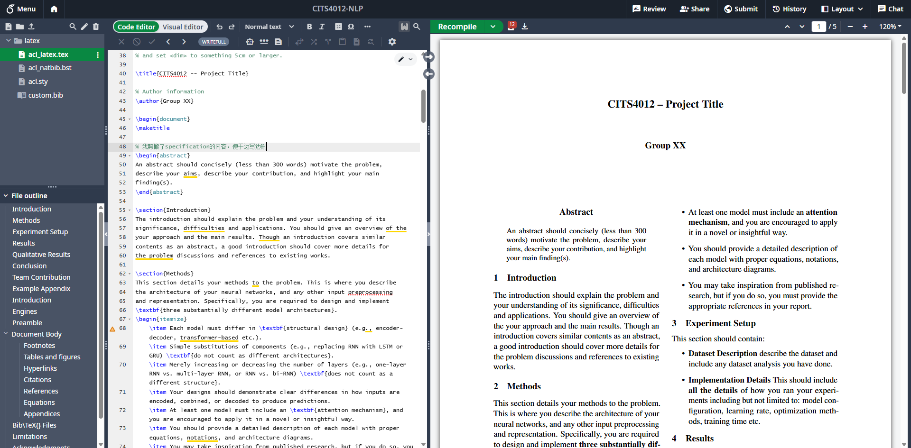

# CITS4012-NLP

> **NOTE**
>
> * 本`README.md`主要用于团队沟通，并在**定稿时改为English便于评分**
> * 定稿后将公开这个库，简历里能多水一行，故而**请使用 all in English commits**
> * 需确保push的`.ipynb`不包含示例输出，以防污染GitHub远程库

## 🤝Collaborators

| Uni ID   | Student Name  | GitHub Username                                   |
| -------- | ------------- | ------------------------------------------------- |
| 24141207 | Kaichao Zheng | [Kaichao-Zheng](https://github.com/Kaichao-Zheng) |
| 24645175 | Ziqi Meng     | [jiongge39](https://github.com/jiongge39)         |
| 23998001 | Yanglei Yuan  | [LeoYuan0225](https://github.com/LeoYuan0225)     |

## 🚀Getting Started

[](#work-on-jupyter-notebook) [](#work-on-latex-report)


## 💻Work on Jupyter Notebook

### Installation

```bash
git clone https://github.com/Kaichao-Zheng/CITS4012-NLP.git
```

### Enable `.ipynb` version control using `nbstripout`

* `nbstripout`主要用于commit时自动清理`.ipynb`的输出，避免污染GitHub远程库

```bash
pip install nbstripout
nbstripout --install
```

### Enable `.ipynb` difference using `nbdime`

* 默认`git diff`显示为JSON格式，不够直观

```bash
pip install nbdime
nbdime config-git --enable
```

### Check `.ipynb` Difference

#### Option 1: Default Git Diff

```bash
git diff CITS4012_YourGroupID.ipynb
```

Press **Q** to stop.

#### Option 2: nbdime CLI Diff

```bash
nbdiff CITS4012_YourGroupID.ipynb
```

#### Option 3: nbdime GUI diff (Recommended)


#### Option 4: nbdime Web GUI (Recommended)

```bash
nbdiff-web CITS4012_YourGroupID.ipynb
```

Press **CTRL+C** to stop local web server.


## 📝Work on LaTeX Report

### Overleaf – The co-editing platform

[点击跳转实时编辑界面](https://cn.overleaf.com/3727936337rsqcchdtcjbk#327efe)

### File Structure

基于指定的ACL模板结构，删减不必要的文件

```
/latex
├── acl_latex.tex		# latex report content 报告内容
├── acl_natbib.bst		# styling bibliography 文献美化
├── acl.sty				# styling latex report 报告美化
└── custom.bib			# bibliography content 文献内容
```

### Report Content

我已将[项目要求](https://lms.uwa.edu.au/bbcswebdav/pid-4638361-dt-content-rid-56793887_1/xid-56793887_1)并入指定的[ACL模板](https://github.com/acl-org/acl-style-files)，下滚即可看到


